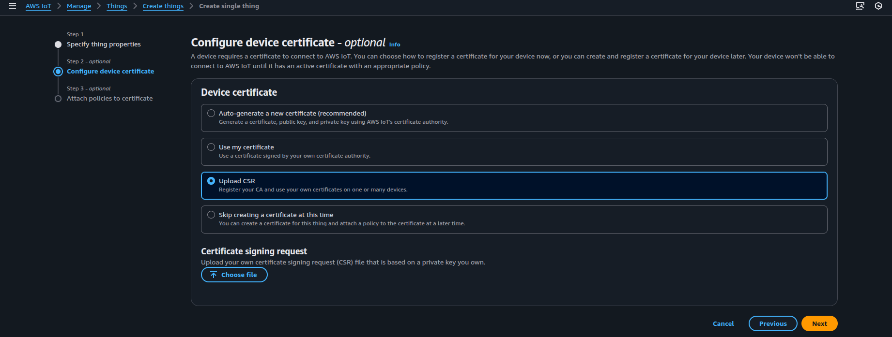

# Build Procedure For Direct Internet Connectivity (DIC)

## Build command with DIC

-   To enable DIC functionality use the `enable_matter_aws=true` flag.

````

### Here is an example to build the lighting-app with DIC for the SiWx917 SoC

```shell
./scripts/examples/gn_silabs_example.sh examples/lighting-app/silabs/ out/debug BRD4338A enable_matter_aws=true chip_enable_wifi_ipv4=true
````

## Compile using new/different certificates

-   Two devices should not use the same Client ID. Use a different Client ID for
    your second connection.
-   While using AWS, Change the following:
    -   Add your AWS certificates in file
        `examples/platform/silabs/matter_aws/matter_aws_interface/include/MatterAwsNvmCert.h`
        -   Provide the AWS Root CA key
            (https://www.amazontrust.com/repository/AmazonRootCA3.pem)
        -   provide device_certificate and device_key with your device cert and
            device key. Refer
            [Openssl Device Certificate Creation](#matter--aws-device-openssl-keys-generation)
    -   Add your AWS server and Clinet ID in file
        `examples/platform/silabs/matter_aws/matter_aws_interface/include/MatterAwsConfig.h`
        -   Provide `MATTER_AWS_SERVER_HOST` with your AWS Server name
        -   provide `MATTER_AWS_CLIENT_ID` with your device/thing ID
-   The preferred certificate type to use in the application is ECDSA.
-   AWS RootCA used in this PoC is
    https://www.amazontrust.com/repository/AmazonRootCA3.pem

## Matter + AWS device openssl keys generation

## Openssl Installation (In ubuntu)

1. To install openssl - `sudo apt install openssl`

## Certificates Creation

The following commands are used to generate certificates:

1. To generate Client key:
    - `openssl ecparam -name prime256v1 -genkey -noout -out device.key`
2. To generate Client certificate (ex: `device.crt` and `device.key`) using CA
   certficate:
    - `openssl req -new -out device.csr -key device.key`
3. While creating AWS thing , use Upload CSR option in configure device
   certificate step. once uploaded the CSR generated in step 2. AWS will
   generate AWS CA authenticated device.crt.
   

Repeat step 1 and 2 to create an additional set of certificate to use in MQTT
explorer (ex: `explorer.crt` and `explorer.key`). (Create with different name
for Identification)
