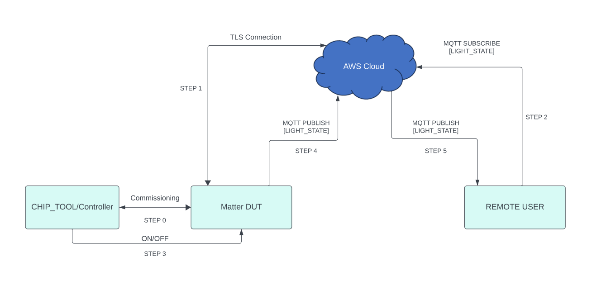

# Matter Wi-Fi + AWS Component

-   Matter+AWS is a silabs only feature to connect matter devices to proprietary
    cloud solutions(AWS,GCP,APPLE ...) directly. As such, a Matter Wi-Fi device
    must support connecting locally on the Matter Fabric, via IPv6, and
    connecting to the Internet via IPv4.
-   Matter devices can be controlled by chip-tool or controller and the
    respective status of the attribute modified will be published to the cloud.
-   Remote user can install the cloud specific application to get the
    notification on the attribute status.

## Matter + AWS Feature Diagram

1. Below diagram gives end-to-end flow about Direct Internet Connectivity.

## Prerequisites

### Hardware Requirements

For the list of hardware requirements for Matter + AWS feature , see the
official
[Silicon Labs Matter HW requirements](https://siliconlabs.github.io/matter/latest/general/HARDWARE_REQUIREMENTS.html)
documentation.

### Software Requirements

For the list of software requirements for Matter + AWS feature , see the
official
[Silicon Labs Matter Software requirements](https://siliconlabs.github.io/matter/latest/general/SOFTWARE_REQUIREMENTS.html)
documentation.

## End-to-End Set-up bring up

## Message Queuing Telemetry Transport (MQTT)

-   MQTT is an OASIS standard messaging protocol for the Internet of Things
    (IoT). It is designed as an extremely lightweight publish/subscribe
    messaging transport that is ideal for connecting remote devices with a small
    code footprint and minimal network bandwidth. Refer https://mqtt.org/ for
    more details

### Building Matter Matter + AWS Application

1. To Build Matter + AWS Application, refer
   [Building of Matter + AWS](./silabs_matter_aws_build_guide.md)
2. Commission the Matter Device and confirm Matter + AWS connection is done from
   Device side logs.

## End-to-End Test of Matter + AWS Application

-   **Sharing status of device to cloud**

    -   Below diagram gives end-to-end flow for sharing status from matter
        device to cloud

        

**Note**: For reference, Lighting App commands given in the above image.
Similarly other application commands also can be passed. - End-to-end command to
be executed from chip-tool, refer
[Running the Matter Demo](RUN_DEMO.md#demo-execution---commissioning-a-wi-fi-device-using-chip-tool-for-linux) -
Below is the application specific attribute/s information or state shared to the
cloud through Direct Internet Connectivity Solution - For Lighting App, On/Off
Attributes - For Lock App, lock/unlock Attributes - For On/off Plug App, On/Off
Attributes - For Windows App, lift/tilt Attributes - For Thermostat App,
SystemMode/CurrentTemp/LocalTemperature/OccupiedCoolingSetpoint/OccupiedHeatingSetpoint
Attributes - Application status would be updated on the mqtt_explorer UI, as
shown in below image.

-   **Control of the device through cloud interface**
    -   Below diagram gives end-to-end flow for Control of the matter device
        through cloud interface
        

**Note**: For reference, Lighting App commands given in the above image.
Similarly other application commands also can be passed.

-   Make sure matter device is up and commissioned successfully, refer
    [Running the Matter Demo](RUN_DEMO.md#demo-execution---commissioning-a-wi-fi-device-using-chip-tool-for-linux)
-   For Controlling the device, set topic name and the commands to be executed
    in the mqtt_explorer for below applications.
    -   Lighting App
        -   Topic: command
            -   Commands:
                -   toggle
                -   on
                -   off
    -   Onoff-plug App
        -   Topic: command
            -   Commands:
                -   toggle
                -   on
                -   off
    -   Lock App
        -   Topic: command
            -   Commands:
                -   lock
                -   unlock
    -   Thermostat App
        -   Topic: command
            -   Commands:
                -   SetMode/value(value need to provide 1,2,3,4 ex:SetMode/1)
                -   Heating/value(value need to provide 2500,2600
                    ex:HeatingSetPoint/2500)
                -   Cooling/value(value need to provide 2500,2600
                    ex:CoolingSetPoint/2500)
    -   Window App
        -   Topic: command
            -   Commands:
            -   Lift/value(value need to provide in range 1000 to 10000 ex:
                Lift/2500)
            -   Tilt/value(value need to provide in range 1000 to 10000 ex:
                Tilt/2500)
-   Then click `publish` button to execute the command.

    
